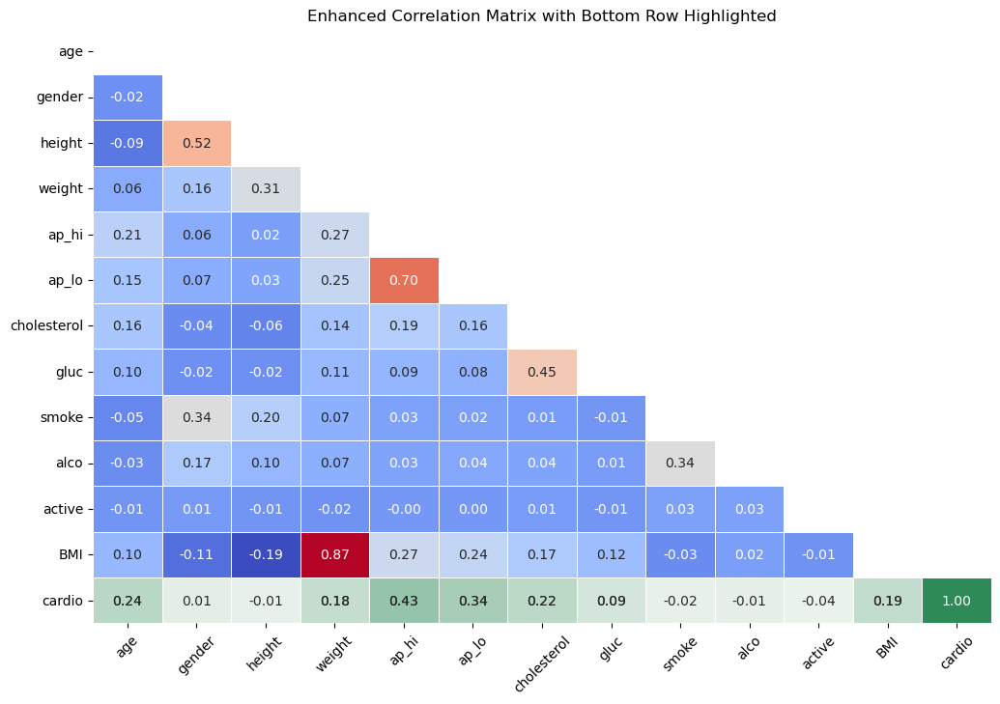
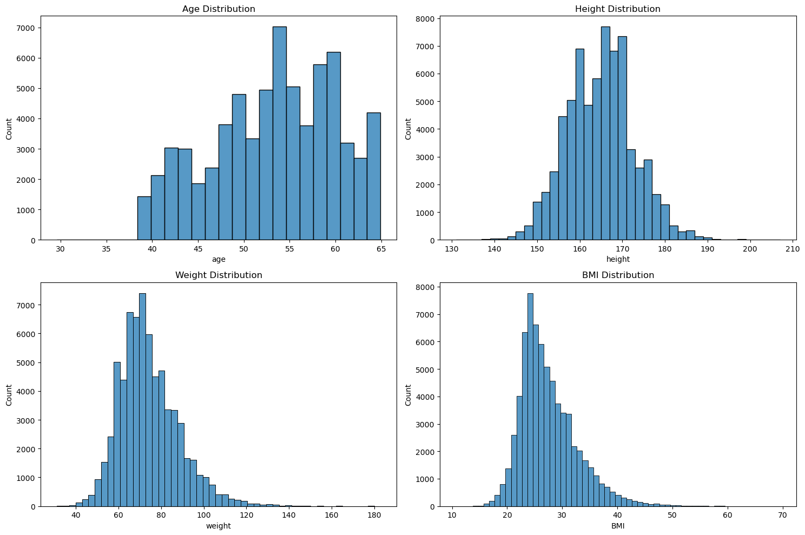
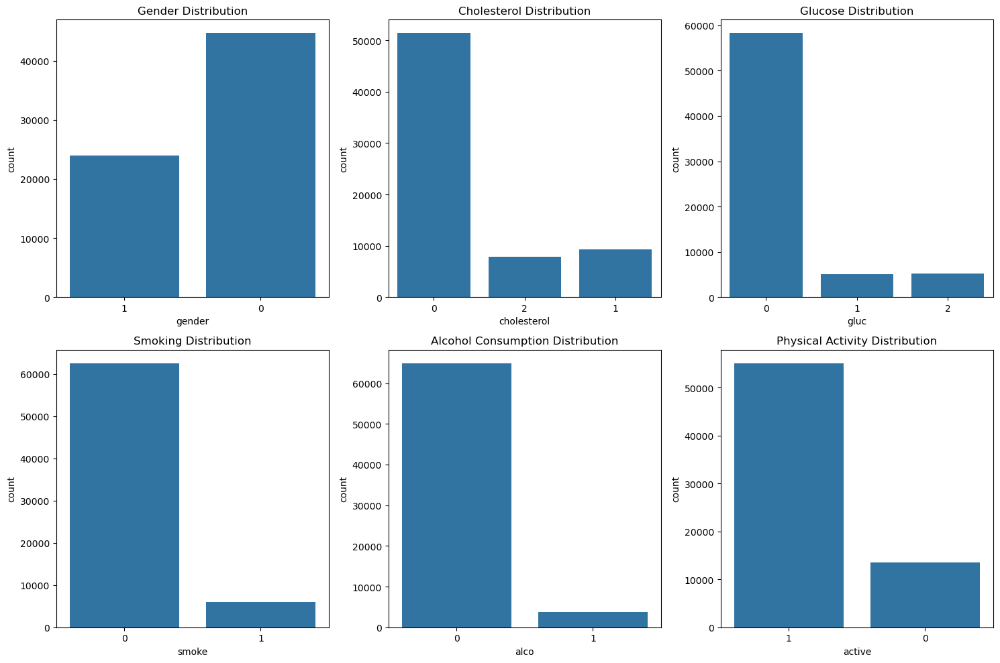
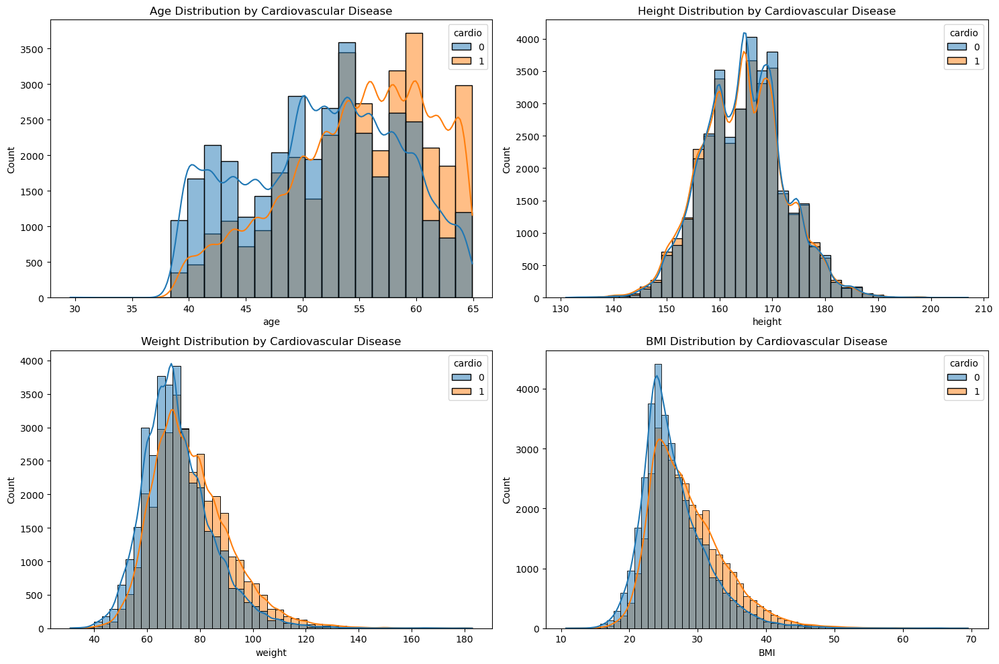
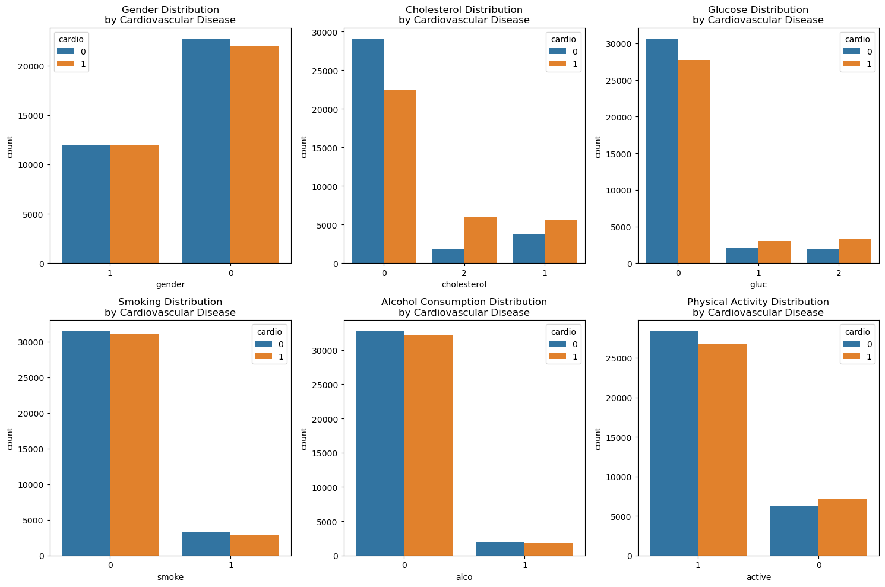

```{r setup, include=FALSE}
# Load required libraries
library(randomForest)
library(caret)
library(Metrics)
library(gridExtra)
library(dplyr)
library(ggplot2)
library(car)
library(rpart)
library(rpart.plot)

knitr::opts_chunk$set(echo = TRUE)
# 
```

```{r functions, include=FALSE, echo=FALSE, include=FALSE}
# Define likelihood_ratio_test function
likelihood_ratio_test <- function(full_model, null_model) {
  LR_statistic <- -2 * (logLik(null_model) - logLik(full_model))
  df <- df.null - df.full
  p_val <- pchisq(LR_statistic, df, lower.tail = FALSE)
  return(c(LR_statistic, p_val))
}

```

# Import the data

```{r data, echo=TRUE}
# Define the current working directory
cwd <- getwd()

# Load the data
data <- read.csv(file.path(cwd, 'health_data.csv'))

# Display the first few rows of the data
head(data)
```

The data includes columns for the following variables:

-   id: a unique identifier for each patient;

-   an unnamed column as an index;

-   age: the age of the patient in days;

-   gender: a categorical feature for the sex of the patient, with 0 for "female" and 1 for "male";

-   height: height of patients in cm;

-   weight: the weight of the patients in kg;

-   ap_hi: systolic blood pressure, in mmHg;

-   ap_lo: diastolic blood pressure, in mmHg;

-   cholesterol: a categorical feature that codifies as 0 a normal level of cholesterol, 1 an above average level of cholesterol and with 2 a well above average level of cholesterol;

-   gluc: a categorical feature that codifies as 0 a normal level of glucose, 1 an above average level of glucose and with 2 a well above average level of glucose;

-   smoke: codifies whether the patient is a smoker or not;

-   alco: codifies whether the patient is an habitual alcohol consumer;

-   active: codifies whether the patient is physically active or not;

-   cardio: the target variable, codifies whether the patient has been diagnosed with a cardiac disease.

It's necessary to filter these columns by dropping the first two columns which are useless, converting the age from days into years, filtering for NaNs, Infs, eliminate absurd values (there are, for instance, negative pressure values, or values well above what's physically possible, and some that are obvious input mistakes, but in a complicated way that would require edit by hand of each "wrong" value). A BMI column is added, since we expect height to be of little importance and the weight alone is insufficient to determine the body type of a person.

```{r data_cleaning, echo=TRUE}
# Create a working copy to avoid modifying the original data
df <- data

# Define the list of categorical variables
categorical <- c('gender', 'cholesterol', 'gluc', 'smoke', 'alco', 'active', 'cardio')

# Replace infinite values with NA in the entire data frame
df <- as.data.frame(lapply(df, function(x) replace(x, is.infinite(x), NA)))

# Remove NaNs, although according to the data description there are no NaNs
df <- na.omit(df)

# Drop the id column and -1
df <- df[, !(names(df) %in% c('id', 'X'))]

# Convert age in days
df$age <- df$age / 365.25

# Filter for impossible values for height, weight, ap_hi, ap_lo
df <- df[df$height > 130 & df$height < 220, ]
df <- df[df$weight > 30 & df$weight < 200, ]
df <- df[df$ap_hi > 60 & df$ap_hi < 240, ]
df <- df[df$ap_lo > 40 & df$ap_lo < 200, ]
df <- df[df$age < 100, ]

# Add a new column for the BMI
df$BMI <- df$weight / (df$height / 100)^2

# Filter for reasonable values for BMI
df <- df[df$BMI > 6 & df$BMI < 70, ]

# Convert all categorical variables to factors
df[categorical] <- lapply(df[categorical], as.factor)

# Display the first few rows of the cleaned data
head(df)
```

# EDA
Here's the summary statistics for the cleaned dataset:
```{r dataset_analysis_summary, echo=TRUE}
# Summary statistics
summary(df)
```

The cleaned dataset contains 68,000 observations and 13 variables. The target variable is "cardio", which is a binary variable that indicates whether a patient has been diagnosed with a cardiac disease or not. The other variables include 6 numerical variables and 6 categorical variables, as listed above.  
Let's now proceed with the exploratory data analysis (EDA) to better understand the distribution of the variables and their relationships with the target variable. The R code is for illustrative purposes only, the plots have been obtained in Python and are displayed below.

```{r dataset_analysis_plots, echo=FALSE, eval=TRUE}



```

```{r dataset_analysis, eval=TRUE, echo=TRUE}
# Create a copy of the cleaned dataset to use for EDA
df_plot <- df

#########################
## Numerical Variables ##
#########################

# First, install and load the MASS package
library(MASS)

# Let's say you have some data in a variable called 'df_plot'
# This is just an example, replace it with your actual data

# Fit a beta distribution to 'age'
fit_beta_age <- fitdistr(df_plot$age, "beta")
print(fit_beta_age)

# Fit an exponential distribution to 'height'
fit_exp_height <- fitdistr(df_plot$height, "exponential")
print(fit_exp_height)

# Create the layout for the plots
par(mfrow=c(2, 2), mar=c(5, 4, 4, 2) + 0.1, oma=c(0, 0, 2, 0))

# Create histograms for the numerical variables
hist(df_plot$age, breaks=seq(min(df_plot$age), max(df_plot$age) + 1.5, by=1.5), col='lightblue', main='Age Distribution', xlab='Age', freq=FALSE)
lines(density(df_plot$age), col="red")  # Add density plot
curve(dbeta(x, fit_beta_age$estimate[1], fit_beta_age$estimate[2]), add=TRUE, col="blue")  # Add fitted beta distribution

hist(df_plot$height, breaks=seq(min(df_plot$height), max(df_plot$height) + 2, by=2), col='lightblue', main='Height Distribution', xlab='Height', freq=FALSE)
lines(density(df_plot$height), col="red")  # Add density plot
curve(dexp(x, fit_exp_height$estimate), add=TRUE, col="blue")  # Add fitted exponential distribution

# Continue with your other plots...

# Add a title to the plots
mtext("Numeric Variables", outer=TRUE, cex=1.5)


###########################
## Categorical Variables ##
###########################

# Create the layout for the plots
par(mfrow=c(2, 3), mar=c(5, 4, 4, 2) + 0.1, oma=c(0, 0, 2, 0))

# Create bar plots for the categorical variables
barplot(table(df_plot$gender), col='lightblue', main='Gender Distribution', xlab='Gender')

barplot(table(df_plot$cholesterol), col='lightblue', main='Cholesterol Distribution', xlab='Cholesterol')

barplot(table(df_plot$gluc), col='lightblue', main='Glucose Distribution', xlab='Glucose')

barplot(table(df_plot$smoke), col='lightblue', main='Smoking Distribution', xlab='Smoking')

barplot(table(df_plot$alco), col='lightblue', main='Alcohol Consumption Distribution', xlab='Alcohol Consumption')

barplot(table(df_plot$active), col='lightblue', main='Physical Activity Distribution', xlab='Physical Activity')

# Add a title to the plots
mtext("Categorical Variables", outer=TRUE, cex=1.5)
```

Now the distributions by target variable:

```{r dataset_analysis_target, eval=TRUE, echo=FALSE}



```

According to the distributions, we can see that the difference between the distributions of the height is entirely identical between the two classes, while a difference exists for the other numerical variables. We'll eliminate the height variable from the analysis.  
For the categorical variables, we can see that the distributions are fairly different for some of the variables, but it's hard to evaluate if the observed differences are given by an actual relationship or just by chance. We'll proceed with the analysis to better understand the relationships between the variables and the target variable, after plotting the correlation matrix.

```{r corr_matrix, eval=TRUE, echo=TRUE}


```

```{r EDA, eval=FALSE, echo=TRUE}

########################
## CORRELATION MATRIX ##
########################

# Assuming df is your dataframe
# Filter out non-numeric columns
df_numeric <- df %>% select_if(is.numeric)

# Calculate the correlation matrix on the numeric dataframe
cor_matrix <- cor(df_numeric) %>% as.matrix()

# Create the heatmap
heatmap(cor_matrix,
        Rowv = NA, Colv = NA,
        col = colorRampPalette(c("blue", "white", "red"))(30),
        main = 'Correlation Matrix',
        margins = c(5,5),
        cexRow = 1, cexCol = 1,
        symm = TRUE,
        revC = TRUE)

#######################################################
## DISTRIBUTION OF DATA ACCORDING TO TARGET VARIABLE ##
#######################################################

## Numerical ##

# Create the layout for the plots
par(mfrow=c(3, 3), mar=c(5, 4, 4, 2) + 0.1, oma=c(0, 0, 2, 0))

# Create histograms for the numerical variables
hist(df$age[df$cardio == 0], col='lightblue', main='Age Distribution \n by Cardiovascular Disease (No)', xlab='Age', breaks=seq(min(df$age), max(df$age) + 1.5, by=1.5), xlim=c(min(df$age), max(df$age) + 1.5))

hist(df$age[df$cardio == 1], col='lightcoral', main='Age Distribution \n by Cardiovascular Disease (Yes)', xlab='Age', breaks=seq(min(df$age), max(df$age) + 1.5, by=1.5), xlim=c(min(df$age), max(df$age) + 1.5))

hist(df$height[df$cardio == 0], col='lightblue', main='Height Distribution \n by Cardiovascular Disease (No)', xlab='Height', breaks=seq(min(df$height), max(df$height) + 2, by=2), xlim=c(min(df$height), max(df$height) + 2))

hist(df$height[df$cardio == 1], col='lightcoral', main='Height Distribution \n by Cardiovascular Disease (Yes)', xlab='Height', breaks=seq(min(df$height), max(df$height) + 2, by=2), xlim=c(min(df$height), max(df$height) + 2))

hist(df$weight[df$cardio == 0], col='lightblue', main='Weight Distribution \n by Cardiovascular Disease (No)', xlab='Weight', breaks=seq(min(df$weight), max(df$weight) + 3, by=3), xlim=c(min(df$weight), max(df$weight) + 3))

hist(df$weight[df$cardio == 1], col='lightcoral', main='Weight Distribution \n by Cardiovascular Disease (Yes)', xlab='Weight', breaks=seq(min(df$weight), max(df$weight) + 3, by=3), xlim=c(min(df$weight), max(df$weight) + 3))

hist(df$BMI[df$cardio == 0], col='lightblue', main='BMI Distribution \n by Cardiovascular Disease (No)', xlab='BMI', breaks=seq(min(df$BMI), max(df$BMI) + 1, by=1), xlim=c(min(df$BMI), max(df$BMI) + 1))

hist(df$BMI[df$cardio == 1], col='lightcoral', main='BMI Distribution \n by Cardiovascular Disease (Yes)', xlab='BMI', breaks=seq(min(df$BMI), max(df$BMI) + 1, by=1), xlim=c(min(df$BMI), max(df$BMI) + 1))

# Add a title to the plots
mtext("Numerical Variables", outer=TRUE, cex=1.5)

```

Let's now checkout the variance inflation factor (VIF) to check for multicollinearity between the numerical variables.

```{r VIF, echo=TRUE}

df_vif <- df

# Drop the height column
df_vif <- df_vif %>% select(-height)

no_height <- glm(cardio ~ ., data = df_vif, family = binomial(link = "logit"))

summary(no_height)

vif(no_height)

```

It seems that all the collinearity is reasoanbly low, so we can proceed with the analysis.

# Logistic Regression

```{r logistic_reg, echo=TRUE}
# Drop the height column and make a copy
df_logi <- df %>% select(-height)

# Fit the logistic regression model
logi_model <- glm(cardio ~ ., data = df_logi, family = binomial(link = "logit"))

# Summary of the model
summary(logi_model)

# Compare the model with the null model
anova(logi_model, test = "Chisq")
```

The full model is significantly better than the null model, but some of the variables are not statistically significant, except for glucose, for which the level 1 is not significant while the level 2 is, but it's negatively correlated with the target variable, but the coefficient is negative, which is contrary to known medical research. We therefore hypothesize that the glucose variable has a spurious relationship with the target variable, and we will thus drop it from the model. 

```{r logistic_reg_2, echo=TRUE}
# Drop the gender1 and the gluc1 columns and make a copy
df_logi_2 <- df_logi %>% select(-gender, -gluc)

# Fit the logistic regression model
logi_model_2 <- glm(cardio ~ ., data = df_logi_2, family = binomial(link = "logit"))

# Summary of the model
summary(logi_model_2)

# Compare the model with the null model
anova(logi_model_2, test = "Chisq")

# Compare the two models
anova(logi_model, logi_model_2, test = "Chisq")
```

The second model is significantly better than the null model, and it is also significantly better than the first model.  


## Tree


```{r TREE, echo=TRUE}

# Create a copy without the excluded variables
df_tree<-df %>% select(-gender, -gluc, -height)

# Perform a train-test split (80/20)
set.seed(42) # For reproducibility

# Set the parameters for the decision tree
cp = c(0.01, 0.001, 0.0001)
minsplit = c(10, 30, 100)
minbucket = c(10, 30, 100)
maxdepth = c(10, 20, 30)

trainIndex <- createDataPartition(df_tree$cardio, p = 0.8, list = FALSE)

df_train <- df_tree[trainIndex, ]

df_test <- df_tree[-trainIndex, ]

# Create a decision tree classifier with parameters adjusted for more branches
dt <- rpart(formula = cardio ~ ., 
            data = df_train, 
            method = "class", 
            control = rpart.control(minsplit = 10,    # Lowered to allow more splits
                                    minbucket = 10,  # Lowered to allow smaller leaf nodes
                                    maxdepth = 10    # Increased to allow deeper trees
                                    ))

# If you want to visualize the tree
rpart.plot(dt)

```

We found the values using the following cross validation:

```{r CV, eval=FALSE, echo=TRUE}

cps = c(0.01, 0.001, 0.0001)
min_buccket = c(10, 30, 100)
max_depth = c(10, 20, 30)
min_split = c(10, 30, 100)
hps = expand.grid(cps=cps, min_buccket=min_buccket, max_depth=max_depth, min_split=min_split, acc=c(-1))
k = 10

set.seed(123)  # Set seed for reproducibility
folds <- createFolds(df_tree$cardio, k = k)

for (i in 1:nrow(hps)) {
  # Initialize vector to store fold errors
  fold_errors <- numeric(10)
  
  for (fold in 1:k) {
    # Split data into training and validation sets
    train_indices <- unlist(folds[-fold])
    validation_indices <- unlist(folds[fold])
    print(hps[i, 3])
    model = rpart(formula = cardio ~ ., 
            data = df_tree[train_indices,], 
            method = "class", 
            control = rpart.control(maxdepth = hps[i, 3], 
                                    minsplit = hps[i, 4],
                                    minbucket = hps[i, 2], 
                                    cp = hps[i, 1]))
    test = df_tree[validation_indices, ]
    y_pred = predict(model, test, type="class")
    acc = mean(y_pred == test$cardio)
    hps[i, 5] = acc
  }
}

```

## Random Forest

```{r FOREST, eval=FALSE, echo=TRUE}
# Create a copy of the cleaned dataset to use for feature importance
df_forest <- df_tree

# Perform a train-test split (80/20)
trainIndex <- createDataPartition(df_forest$cardio, p = 0.8, list = FALSE)

df_train <- df_forest[trainIndex, ]
df_test <- df_forest[-trainIndex, ]

# Divide the data into features and target for training
X_train <- df_train[, !(names(df_train) %in% c('cardio'))]
y_train <- df_train$cardio

# Divide the data into features and target for testing
X_test <- df_test[, !(names(df_test) %in% c('cardio'))]
y_test <- df_test$cardio

# Create a random forest classifier
rf <- randomForest(x = X_train, y = y_train, ntree = 500, importance = TRUE, seed = 42)

# Make predictions
y_pred <- predict(rf, X_test)

# Print the confusion matrix
confusionMatrix(y_pred, y_test)

# Get the feature importances
feature_importances <- importance(rf)
str(feature_importances)
print(feature_importances)
```
